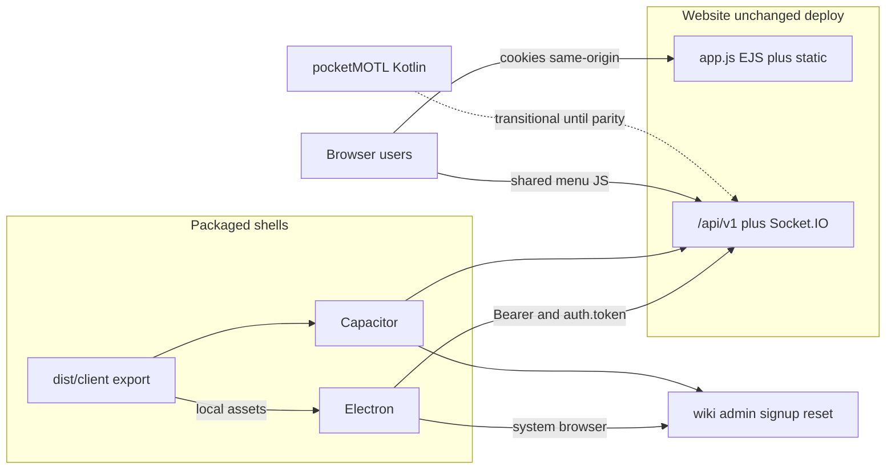

# Cross-platform packaging (Electron + Capacitor)

## Audit summary (current blockers)

The live site is same-origin SSR: EJS templates, cookie session (`lane.sid`), and Socket.IO with no URL or `auth.token` in [public/js/main.js](public/js/main.js). Absolute root paths (`/js`, `/shared`, `/vendor/three`), CSP `connect-src 'self'`, and Origin checks in [server/hardening.js](server/hardening.js) assume one host.

Already ready for shells: `/api/v1/*` plus Socket.IO `auth.token` (Bearer equals express-session id), CSRF-exempt, Formbar/Discord deep-link callbacks (today default `pocketmotl://auth` in [app.js](app.js)). pocketMOTL is a separate Kotlin Compose Android app on Desktop (`c:\Users\csmith.YORKTECHIT\Desktop\pocketMOTL`); it stays intact until Capacitor Android passes the parity gate below.

Website deploy (`npm start`, nginx example) stays the authoritative server; shells never embed the Node sim.

## Chosen product model



- **In-shell (local assets):** match UI (2D/3D), games/matchmaking, lobby create/join, account strip (name/tickets/MMR), Formbar/Discord login via system browser plus deep link, Digipog ticket PIN (existing API).
- **System browser only:** wiki, admin, email signup/forgot/reset, full profile editing, landing news, suggestion/wiki edit flows that need CSRF forms.
- **Single frontend source:** [public/](public/), [shared/](shared/), thin HTML entrypoints. No duplicate lobby/game UI in platform folders. Platform code only: window chrome, deep links, openExternal, server URL, token storage hooks.
- **pocketMOTL:** coexist during Capacitor development; retire only after explicit parity + test sign-off (Phase 8). Do not delete or modify pocketMOTL during packaging implementation.

## Target layout

```
dist/client/                 # build output only (gitignored)
platforms/electron/          # main/preload, electron-builder, Steam later
platforms/capacitor/         # capacitor.config, android/, ios/
scripts/export-client.js     # copies shared frontend into dist/client
shared/protocol.js           # PROTOCOL_VERSION plus compatibility helpers
public/js/runtime.js         # cookie vs token, server URL, socket, external links
public/js/menus/             # shared games / lobby-create / account UI
```

Root [package.json](package.json) gains platform scripts; no npm workspaces required. Existing web scripts stay as today. pocketMOTL remains outside this repo until retirement.

---

## pocketMOTL audit (retirement planning only)

Location: `c:\Users\csmith.YORKTECHIT\Desktop\pocketMOTL` (separate Android Studio project; **not** inside menoftheline). No `.github/workflows` in that tree. Package id `edu.ycst.pocketmotl`.

### Obsolete when Capacitor replaces it (entire native UI stack)

All of the following becomes deletable **after** the parity gate — nothing is removed during packaging work:

| Area | Paths / artifacts |
|------|-------------------|
| Kotlin app entry | `app/src/main/java/edu/ycst/pocketmotl/MainActivity.kt` |
| Compose UI | `ui/MotlApp.kt`, `BoardCanvas.kt`, `BattlefieldRenderer.kt`, `BuyArt.kt`, `MotlTheme.kt`, `GameViewModel.kt` |
| Native net | `net/MotlApi.kt`, `GameSocket.kt`, `JsonProtocol.kt` |
| Mirrored game rules | `model/MotlConfig.kt`, `MotlUnits.kt`, `MotlPath.kt`, `Board.kt`, `Protocol.kt`, `Telescope.kt`, `CanvasHud.kt`, `InspectReadout.kt` |
| Audio | `audio/MotlAudio.kt` + bundled BGM if any |
| Unit tests | `app/src/test/java/.../BoardTest.kt` |
| Assets (copied SVGs) | `app/src/main/assets/img/*.svg` |
| Manifest / theme / network | `AndroidManifest.xml`, `res/`, `network_security_config` |
| Gradle / Android Studio | root `build.gradle.kts`, `settings.gradle.kts`, `gradle.properties`, `app/build.gradle.kts`, wrapper, `.idea/` |
| Docs / plans in that repo | `README.md`, `goals.md`, `.cursor/plans/` |
| Dependencies (app module) | Compose BOM/UI/Material3, activity-compose, lifecycle-viewmodel-compose, `androidx.browser:browser`, `io.socket:socket.io-client`, `androidsvg-aar`, JUnit |

Capacitor will introduce its **own** `platforms/capacitor/android/` Gradle tree; that is not a reuse of the pocketMOTL project.

### Server / API / shared changes made for pocketMOTL (in menoftheline)

These were built as the **native Client API**, not Kotlin-only hacks. **Preserve** for Capacitor, Electron, load tests, and `test/clientApi.test.js`:

- Full `/api/v1/*` surface in [app.js](app.js): session, me, Formbar/Discord login + callbacks, login/token, logout, lobbies, match-options, tickets, play, metrics
- Socket.IO `handshake.auth.token` path + Origin exception when token present ([server/hardening.js](server/hardening.js))
- CSRF exemption for `/api/v1` ([server/csrf.js](server/csrf.js))
- `safeAppReturn` / default return `pocketmotl://auth` (scheme-specific; see cleanup)
- Docs/tests: [AGENTS.md](AGENTS.md), [README.md](README.md), [goals.md](goals.md) Client API items, [test/clientApi.test.js](test/clientApi.test.js), load harness session/play usage

**Do not revert** dual-auth improvements, Discord native login endpoints, ticket/lobby API, or token sockets when retiring pocketMOTL — other clients and Capacitor need them.

**pocketMOTL-specific server strings (trim only in Phase 8):**

- `safeAppReturn` allowlist entry for `pocketmotl://auth`
- Default `return` fallbacks currently `"pocketmotl://auth"` on Formbar/Discord API login routes — change default to `motl://auth` after pocketMOTL is gone; keep allowing `pocketmotl://` only if an old APK must still work during a short deprecation window

No pocketMOTL-only forks exist under `shared/`; Kotlin mirrors of config/units/path are client-side only and die with that repo.

### Reusable Android behaviors (port into Capacitor / web client, do not copy Kotlin)

| Behavior | Where in pocketMOTL | Capacitor / shared plan |
|----------|---------------------|-------------------------|
| Landscape lock | `AndroidManifest` `sensorLandscape` | Capacitor Android activity / `capacitor.config` orientation |
| Edge-to-edge / immersive | `enableEdgeToEdge()` in MainActivity | Status bar / safe-area CSS + Capacitor StatusBar plugin as needed |
| Deep link auth | `pocketmotl://auth?token=` | Register `motl://auth` (and keep `pocketmotl://` until retirement); Browser / Custom Tabs for OAuth |
| Custom Tabs Formbar | `CustomTabsIntent` + `androidx.browser` | `@capacitor/browser` (or equivalent) |
| Server URL + token prefs | SharedPreferences `"pocketmotl"` | `runtime.js` + Capacitor Preferences / localStorage |
| Cleartext debug HTTP | `network_security_config` | Capacitor Android cleartext for debug builds only |
| Touch: swipe orders, pinch zoom, buy-variant swipe | `BoardCanvas.kt` pointerInput | Prefer existing web [public/js/input.js](public/js/input.js) / board hit-testing; add touch polish in **shared** JS if gaps vs pocketMOTL |
| Websocket-first | `transports = websocket` | Already noted in web `main.js`; keep for shells |

**Not present in pocketMOTL (no port needed from Kotlin):** push notifications, FCM, Android foreground services. Mentions of “notifications” in product sense are in-match UI only on web.

**Feature gaps in pocketMOTL vs current web match client** (Capacitor inherits web, so it should **exceed** pocketMOTL here): in-match chat, pause/`pauseSeen`/`settingsOpen`, player report, Discord login UI, and any newer socket events. Parity gate is vs pocketMOTL’s playable loop **plus** essential web match features shipped in the shared client.

### Obsolete outside pocketMOTL tree

- No pocketMOTL GitHub Actions to delete (none found).
- menoftheline CI today is only branch-sync; future `android.yml` targets **Capacitor**, not pocketMOTL.
- menoftheline docs that say “Android app in pocketMOTL” → retarget to `platforms/capacitor/` in Phase 8.

### Parity gate (required before any deletion)

Capacitor Android must demonstrate, on device/emulator against a live MOTL server:

1. Guest session, vs bot / train bot / casual / train casual
2. Formbar OAuth deep link → token stored → `/api/v1/me` shows account
3. Tickets (PIN), ranked queue, create listed lobby, join lobby
4. Match: buy, orders, towns/upgrades, concede/leave, reconnect
5. Socket auth via `auth.token` (no cookie dependency)
6. Protocol/version gate UX (`client_outdated`) smoke
7. Secondary links open system browser (wiki / signup)
8. Orientation / immersive / OAuth UX acceptable vs pocketMOTL
9. Explicit human sign-off recorded (checklist in `docs/packaging.md`)

Until then: do not archive, delete, or break pocketMOTL; keep `pocketmotl://` allowlisted.

---

## Phase 1 — Shared client runtime (website-safe)

Add [public/js/runtime.js](public/js/runtime.js) used by menus and match clients:

- **Browser:** empty server base (same origin), cookie session unchanged, API with `credentials: include`, same-origin Socket.IO as today, home `/games`, normal links for secondary pages.
- **Shell:** `window.MOTL_SERVER_URL` injected by Electron/Capacitor, token from `POST /api/v1/session` persisted, Bearer on API, Socket.IO to server URL with `auth.token` plus protocol fields, home `games.html`, secondary links via `runtime.openExternal`.

**Minimal server auth tweak:** extend `requireApiSession` so `/api/v1` accepts Bearer token OR existing cookie session. One menu codebase runs on the website without forcing browsers onto Bearer-only. CSRF stays exempt for `/api/v1` only.

**Deep links:** expand `safeAppReturn` in [app.js](app.js) to allow `motl://auth` and **keep** `pocketmotl://auth` until Phase 8.

**Match client wiring:** small changes in [public/js/main.js](public/js/main.js) / [main3d.js](public/js/main3d.js) — create socket via `runtime.connectSocket()`, replace hard-coded home navigation with `runtime.goHome()`. No gameplay rewrite.

**CSP / Origin:** website CSP unchanged. Packaged HTML is not served by Express. Tokened sockets already allow missing Origin; keep relying on that rather than allowlisting Capacitor origins in production.

## Phase 2 — Shared lobby / account menus

Today [views/games.ejs](views/games.ejs) and [views/lobby-create.ejs](views/lobby-create.ejs) are server-rendered form POSTs to `/play/*`. Move that UX into `public/js/menus/` calling:

- Existing: `GET /api/v1/me`, lobbies, match-options, `POST /api/v1/play`, tickets, login/logout
- Add thin `GET /api/v1/queues` (or extend `/me` / lobbies) for waiting unranked/ranked counts currently only in `games.ejs`

**Website integration:** keep routes `/games`, `/games/create`, `/play` and EJS shells, but mount shared menu modules instead of duplicating button markup. Legacy form POSTs can remain briefly as fallback, then deprecate once menus are API-only.

**Static entry HTML for export** under `public/app/` (or generated): `games.html`, `lobby-create.html`, `play.html` (from [views/index.ejs](views/index.ejs)), `play3d.html` (from [views/play3d.ejs](views/play3d.ejs)). Former EJS locals become `window.MOTL_BOOT` defaults plus optional `/api/v1/version` / config fetch.

Account menu in-shell: show player/tickets; Log in opens system browser to Formbar/Discord API URLs with `return=motl://auth`; Register / Forgot password / Wiki use `openExternal`. After `POST /api/v1/play`, navigate to local play HTML (shell) or `/play` (website).

## Phase 3 — Client export (no source duplication)

[scripts/export-client.js](scripts/export-client.js):

1. Recreate `dist/client/`
2. Copy `public/**`
3. Copy `shared/**` to `dist/client/shared/`
4. Copy `node_modules/three` to `dist/client/vendor/three` (same URL shape as Express)
5. Write `dist/client/boot.json` with protocolVersion, clientVersion, assetVersion
6. Do not copy EJS, server, or data/

Platforms point at `dist/client` only. Absolute paths keep working because the shell serves the export at origin root (not `file://`).

## Phase 4 — platforms/electron

- Loopback static server (or custom protocol) of `dist/client` so `/js` resolves
- Inject `MOTL_SERVER_URL` (env/settings; default production)
- Register `motl://` deep link; hand token to renderer via preload
- `shell.openExternal` for secondary URLs
- electron-builder for Win/macOS/Linux; Steam depot as follow-on after desktop is stable

Root commands: `client:export`, `desktop:dev`, `desktop:build`.

## Phase 5 — platforms/capacitor (coexist with pocketMOTL)

- `webDir` = `../../dist/client`
- Android + iOS; deep link `motl://auth`
- Browser / Custom Tabs for OAuth and secondary site pages
- Apply reusable Android behaviors from the audit (landscape, immersive, cleartext debug, Preferences)
- **Do not modify or delete** the Desktop pocketMOTL project in this phase
- Optional: dual-register `pocketmotl://` on Capacitor only if a migration redirect is needed; default new scheme is `motl://`

Root commands: `android:dev`, `android:build`, `ios:dev`, `ios:build`.

## Phase 6 — Client/server version compatibility

Add [shared/protocol.js](shared/protocol.js) with integer `PROTOCOL_VERSION` (bump on breaking snapshot/command/API shape) and semver `CLIENT_VERSION`.

Server:

- `GET /api/v1/version` returns protocol, minProtocol, serverVersion, assetVersion
- On Socket.IO handshake and `POST /api/v1/play`, read protocol/clientVersion from auth or headers
- If client protocol is below minProtocol: reject with `client_outdated` and show update-required UI with store/site link
- Additive JSON fields do not bump protocol; older clients ignore unknown keys

Website browsers always get current assets from Express; the gate mainly protects stale packaged builds. Extend [test/clientApi.test.js](test/clientApi.test.js) for version reject/allow.

## Phase 7 — CI (path-filtered)

Add workflows beside [.github/workflows/main.yml](.github/workflows/main.yml) (leave branch-sync alone):

- **web.yml** — app.js, server, shared, public, views, test, package.json → `npm test`
- **desktop.yml** — platforms/electron, public, shared, export script → export + electron-builder artifact
- **android.yml** — platforms/capacitor, public, shared, export → Gradle assemble
- **ios.yml** — same + iOS project → xcodebuild on macos runner

No workflow builds or tests pocketMOTL. Release tags / `workflow_dispatch` can build all Capacitor/Electron platforms.

## Phase 8 — pocketMOTL retirement cleanup (after parity gate only)

Execute only after Phase 5 Capacitor Android meets the parity gate and sign-off is recorded. Prefer archiving the pocketMOTL git history (tag/zip) before deleting the working tree.

### A. Delete / archive (pocketMOTL project — entire tree)

Explicit removal list (whole project root):

- `c:\Users\csmith.YORKTECHIT\Desktop\pocketMOTL\` including:
  - All Kotlin under `app/src/main/java/edu/ycst/pocketmotl/`
  - `app/src/test/`
  - `app/src/main/assets/`, `app/src/main/res/`, `AndroidManifest.xml`
  - Gradle: `build.gradle.kts`, `settings.gradle.kts`, `app/build.gradle.kts`, `gradle/`, wrapper, `gradle.properties`, `local.properties` (local)
  - Compose/Socket.IO/Custom Tabs/AndroidSVG dependencies (go away with the module)
  - `README.md`, `goals.md`, `.cursor/`, IDE files, `app/build/` outputs

### B. menoftheline server/docs — trim scheme-only bits; keep API

**Keep forever (used by Capacitor/Electron/web/tests/load):**

- All `/api/v1/*` routes and `requireApiSession` (including cookie-or-Bearer if added in Phase 1)
- Socket.IO `auth.token` + Origin/`hasAuthToken` behavior
- CSRF `/api/v1` exemption
- [test/clientApi.test.js](test/clientApi.test.js) and load-script session/play usage

**Change after retirement:**

- [app.js](app.js) `safeAppReturn`: default allowlist/primary scheme → `motl://auth`; remove `pocketmotl://` after deprecation window (or keep one release if old APKs still in the wild)
- Login route defaults that currently fall back to `"pocketmotl://auth"` → `"motl://auth"`
- [AGENTS.md](AGENTS.md) / [README.md](README.md) / [goals.md](goals.md): replace “Android app in pocketMOTL” with Capacitor; mark Capacitor idea done; note pocketMOTL retired
- [docs/packaging.md](docs/packaging.md): retirement date + parity checklist archive

**Do not remove** Discord `/api/v1/login/discord*`, tickets, lobbies, match-options, or any shared/sim changes that happened to land in the same era as the Client API.

### C. Dependencies / CI

- No menoftheline npm dependency is pocketMOTL-specific today — no package.json removals for retirement.
- No pocketMOTL GitHub Actions to delete.
- Ensure Capacitor `android.yml` remains the only Android CI.

## What deliberately does not change (until Phase 8)

- Match sim, matchmaking ownership, PM2/nginx web deploy
- Cookie SSR for landing/wiki/admin/login/signup/reset
- pocketMOTL source tree (untouched during Phases 1–7)
- Formbar requirement for Digipog tickets / paid modes
- Token API and Socket.IO auth (never part of retirement deletions)

## Implementation order

1. protocol module, version API, dual cookie/Bearer, `motl://` allowlist (**keep** `pocketmotl://`)
2. runtime.js plus match client socket/home wiring
3. Shared menus, thin EJS/static entrypoints, queues API
4. export-client.js, gitignore dist, root npm scripts
5. Electron shell
6. Capacitor Android then iOS (port reusable Android behaviors; coexist with pocketMOTL)
7. Path-filtered GitHub Actions
8. AGENTS.md plus docs/packaging.md (include parity checklist)
9. **Only after sign-off:** Phase 8 pocketMOTL archive/delete + scheme/docs cleanup

## Risk notes

- Lobby parity: games/lobby-create must be API-complete before removing form POSTs from the critical path.
- OAuth round-trip `motl://auth?token=` must be tested on Android, iOS, and Electron; keep `pocketmotl://` until retirement.
- Export includes three.js plus bgm/img; watch mobile artifact size.
- Steam is an Electron release channel, not a separate UI stack.
- Retiring pocketMOTL too early reintroduces the Kotlin/shared mirror drift problem; the parity gate is mandatory.
- Touch UX: if web input lags pocketMOTL swipe/pinch feel, fix in shared `public/js` before calling parity complete.
